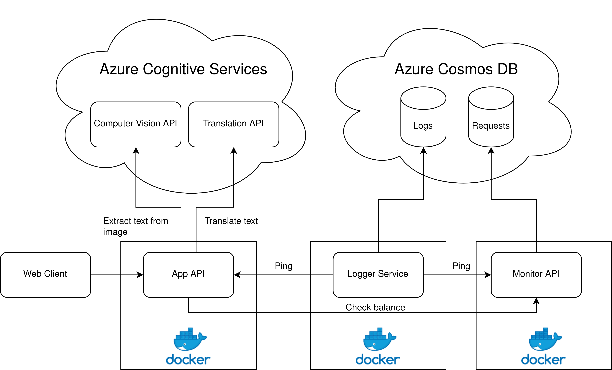
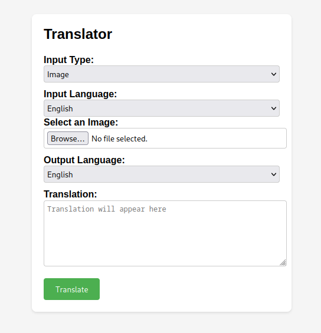

# Introduction

This report presents the architecture and development process of a website aimed
at translating text and images using Azure Cognitive Services. The objective of
this project was to gain familiarity with cloud-based cognitive services and to
fully deploy microservices using containers and Kubernetes. This report provides
an overview of the architecture implemented and reflects on the development
process.

# Architecture Overview

The website's architecture followed a client-server model, utilizing various
components and services to deliver the translation functionality. The key
components of the architecture are as follows:

- **Frontend**: A simple frontend was implemented using HTML, CSS, and
  JavaScript. It's a simple website with an input for either text or an image,
  and an output with the text of the translation.

- **Backend**: The backend was implemented using Python and Flask. It's divided
  in three different applications: 

    - **Application API**: Receives the requests from the frontend does a bit of
      preprocessing and then makes the request to the Azure Cognitive Services
      APIs, specifically the Text Translation and Computer Vision APIs. When
      translating text the text translation API is called. When translating an
      image, first the Computer Vision API is called to extract the text from
      the image. Once the text is obtained then the Text Translation API is
      called.
    - **Monitoring API**: Keeps count of the number of requests made. For every
      request the application receives, the app calls the monitoring API to
      check the balance. If the limit is reached the request is rejected, if not
      then a new record is added to the database.
    - **Logging service**: It runs a background job every 30 min that pings the
      APIs to check if they are running. It then stores the timestamp with the
      response code, the endpoint and the response time.

{width=65%}

# Deployment

## Docker
The three applications are containerized using Docker. Docker
Compose is used to have the different images integrated and helps to set up
things like the API keys using environment variables. This is also an important
step towards later deploying it to Kubernetes.

## Kubernetes

The final step of the deployment is Kubernetes. The first things that had to be 
done is to define a Kubernetes Deployment object, specifying the desired state
of the application. It included information about the Docker image, number of
replicas, etc. We also need to define a Kubernetes service, to expose the 
application internally within the cluster. It provided a stable network endpoint 
for accessing the application. Since we defined the Docker Compose configuration
before, we can use a tool like Kompose to generate these two files and give us
a boilerplate from where we can work. Note that we need to have one deployment 
and one service for each of the applications we have.

Finally, the Docker image and Kubernetes Deployment configuration were deployed 
to the Kubernetes cluster. The cluster automatically manages the scheduling, 
scaling, and health monitoring of the application.
